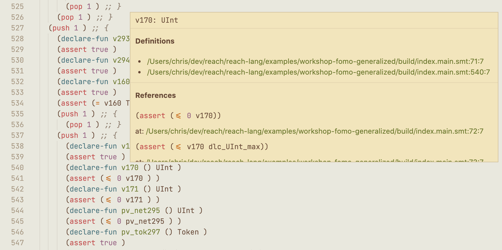

# smt-lsp

SMT-LSP is a language server for SMT that implements the [Language Server Protocol](https://microsoft.github.io/language-server-protocol/).

SMT-LSP will provide the following functionality:
- [] Jump to Definiton
- [x] Hover information
  - [x] Usage/References
  - [x] Sort
- [] Evaluation (run `z3`)

